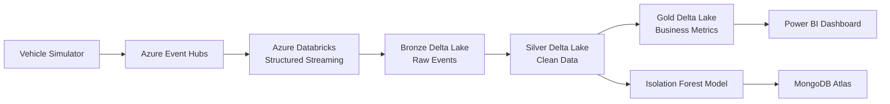

# OmniStream – Fleet Telemetry & Lakehouse Platform

## Overview

OmniStream is a streaming data platform that simulates connected vehicle telemetry and processes events through an Azure-based lakehouse architecture.

The platform ingests vehicle sensor data in real time, applies data quality transformations, stores analytics-ready datasets using Delta Lake, detects abnormal vehicle behavior with machine learning, and provides operational insights through BI dashboards.

The project implements a complete data engineering workflow:

- Real-time telemetry ingestion
- Spark Structured Streaming processing
- Delta Lake medallion architecture
- Data validation and transformation
- Machine learning anomaly detection
- Operational anomaly storage
- Analytics-ready reporting

---

# Architecture



---

# Business Problem

Fleet operators generate large volumes of telemetry data from connected vehicles.

Without proper processing, raw telemetry is difficult to use for:

- Vehicle monitoring
- Maintenance decisions
- Performance analysis
- Operational reporting

OmniStream provides a scalable pipeline for transforming raw vehicle events into trusted datasets and actionable insights.

---

# Technology Stack

## Data Engineering

| Technology | Purpose |
|---|---|
| Python 3.12 | Application development |
| PySpark | Distributed processing |
| Azure Event Hubs | Real-time ingestion |
| Azure Databricks | Streaming workloads |
| Delta Lake | Lakehouse storage |
| Azure Data Lake Storage Gen2 | Cloud storage |

## Machine Learning

| Technology | Purpose |
|---|---|
| pandas | Data processing |
| NumPy | Numerical operations |
| scikit-learn | Machine learning |
| Isolation Forest | Anomaly detection |

## Storage & Analytics

| Technology | Purpose |
|---|---|
| MongoDB Atlas | Operational anomaly storage |
| Power BI | Business dashboards |

## Development

| Technology | Purpose |
|---|---|
| Docker | Local services |
| pytest | Automated testing |
| GitHub Actions | CI/CD |
| python-dotenv | Configuration management |

---

# Data Architecture

OmniStream follows a Bronze → Silver → Gold lakehouse architecture.

## Bronze Layer

The Bronze layer stores raw telemetry events as received from vehicles.

Example fields:

```text
vehicle_id
timestamp
latitude
longitude
speed
fuel_level
engine_temperature
battery_status
```

Responsibilities:

- Raw event ingestion
- Schema preservation
- Historical storage

---

## Silver Layer

The Silver layer creates clean and validated telemetry data.

Processing includes:

- Schema validation
- Data type conversion
- Duplicate removal
- Missing value handling
- Data quality checks
- Event watermarking

Output:

Clean telemetry records suitable for analytics and machine learning.

---

## Gold Layer

The Gold layer contains business-ready datasets.

Examples:

### Fleet Performance

- Vehicle utilization
- Average speed
- Fuel consumption
- Daily fleet activity

### Vehicle Health

- Engine temperature trends
- Battery monitoring
- Fleet health scores

### Route Analytics

- Distance analysis
- Route statistics
- Vehicle movement patterns

---

# Machine Learning Pipeline

OmniStream uses Isolation Forest to identify abnormal vehicle behavior.

The model detects patterns such as:

- Abnormal engine temperature
- Sudden fuel level changes
- Unexpected speed variations
- Battery issues

Pipeline:

```text
Silver Telemetry Data
        |
        v
Feature Engineering
        |
        v
Isolation Forest Model
        |
        v
Anomaly Detection
        |
        v
MongoDB Atlas
```

Detected anomalies are stored separately for operational monitoring.

---

# Repository Structure

```text
OmniStream-Fleet-Telemetry-Lakehouse/

├── vehicle_simulator/       # Generates telemetry events
├── streaming/               # Event ingestion components
├── pyspark/                 # Spark streaming jobs
├── delta/                   # Bronze, Silver, Gold layers
├── ml/                      # ML anomaly detection
├── mongodb/                 # MongoDB integration
├── powerbi/                 # Dashboard documentation
├── config/                  # Configuration management
├── tests/                   # Automated tests
├── scripts/                 # Utility scripts
├── docs/                    # Documentation
├── sample_data/             # Sample telemetry data
├── requirements.txt
├── docker-compose.yml
└── README.md
```

---

# Local Setup

## Clone Repository

```bash
git clone <repository-url>

cd OmniStream-Fleet-Telemetry-Lakehouse
```

---

## Create Virtual Environment

### Python

```bash
python -m venv .venv

source .venv/bin/activate

pip install --upgrade pip

pip install -r requirements.txt
```

### Conda

```bash
conda env create -f environment.yml

conda activate omnistream
```

---

# Configuration

Create environment variables:

```bash
cp .env.example .env
```

Required configuration:

```env
AZURE_EVENTHUB_CONNECTION_STRING=
AZURE_STORAGE_ACCOUNT=
AZURE_STORAGE_KEY=
MONGODB_CONNECTION_STRING=
```

Secrets are not stored inside the repository.

---

# Running Locally

## Start Services

```bash
docker compose up
```

---

## Generate Vehicle Telemetry

```bash
python vehicle_simulator/main.py
```

---

## Run Spark Streaming Pipeline

```bash
python pyspark/streaming_job.py
```

---

## Train ML Model

```bash
python ml/train.py
```

---

## Run Anomaly Prediction

```bash
python ml/predict.py
```

---

# Azure Deployment

The cloud architecture uses the following services:

## Azure Event Hubs

Responsible for:

- Receiving vehicle telemetry events
- Handling high-throughput streaming data

## Azure Databricks

Responsible for:

- Structured Streaming jobs
- Spark transformations
- Delta Lake processing

## Azure Data Lake Storage Gen2

Stores:

- Bronze datasets
- Silver datasets
- Gold analytics tables

## Power BI

Provides:

- Fleet dashboards
- Vehicle monitoring
- Business reporting

---

# MongoDB Integration

MongoDB Atlas stores detected anomaly events.

Features:

- Database connection management
- Collection management
- Index creation
- CRUD operations
- Retry handling

Example anomaly document:

```json
{
  "vehicle_id": "VH1001",
  "event_type": "engine_temperature",
  "value": 145,
  "severity": "high",
  "timestamp": "2026-01-01T12:00:00"
}
```

---

# Power BI Analytics

Gold datasets support dashboards for:

## Fleet Overview

- Vehicle count
- Active vehicles
- Fleet health score

## Vehicle Monitoring

- Speed trends
- Fuel consumption
- Engine temperature
- Battery health

## Anomaly Monitoring

- Active alerts
- Vehicle risk ranking
- Abnormal event tracking

---

# Testing

Testing is implemented using pytest.

Coverage includes:

- Simulator functions
- Spark transformations
- ML modules
- Utility functions

Run tests:

```bash
pytest
```

---

# CI/CD

GitHub Actions can automate:

- Dependency installation
- Unit testing
- Code validation
- Deployment workflows

---

# Future Improvements

Planned enhancements:

- Geofencing alerts
- Predictive maintenance models
- Route optimization analytics
- Databricks notebooks
- Infrastructure as Code deployment
- Automated Azure deployment pipelines

---

# Skills Demonstrated

This project demonstrates experience with:

- Streaming data pipelines
- Azure cloud services
- Lakehouse architecture
- Spark Structured Streaming
- Delta Lake
- Data quality engineering
- Machine learning integration
- Operational analytics systems

---

# License

MIT License