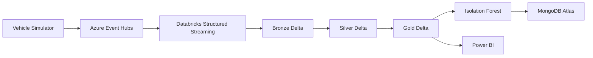
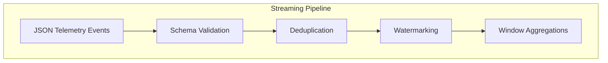
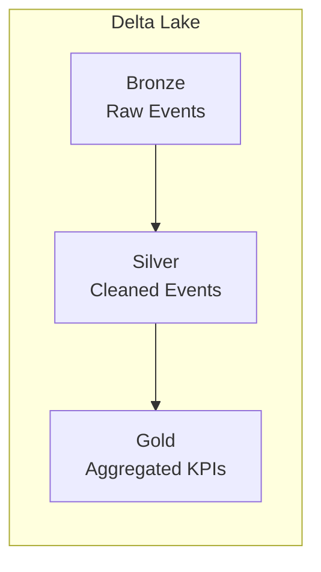
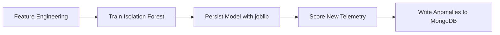
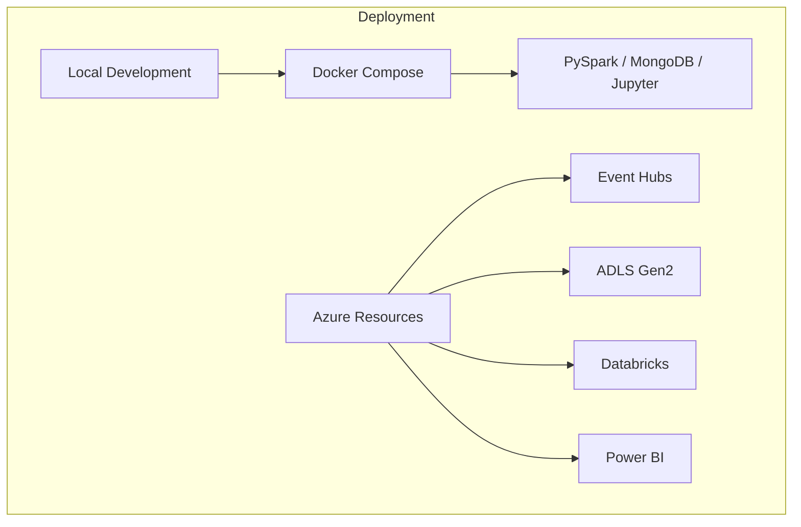

# OmniStream – Fleet Telemetry & Lakehouse


[](https://www.python.org/)
[](https://docs.pytest.org/)
[](LICENSE)
[](https://www.databricks.com/)

## Overview

OmniStream is a portfolio project that simulates telemetry from connected vehicles and processes the stream through a lakehouse-style pipeline on Azure. The project focuses on realistic, interview-friendly data engineering patterns: event generation, cloud ingestion, streaming transformations, Delta Lake medallion layers, anomaly detection, operational storage, and BI-ready outputs.

The implementation is intentionally practical. It uses production-inspired structure, clear configuration management, reusable transformations, structured logging, and tests so that the repository reads like a real project rather than a demo script.

## Business Problem

Fleet operators need near real-time visibility into vehicle health, trip behavior, and operational risks. Raw telemetry alone is noisy and hard to use directly. A lakehouse pipeline helps by ingesting the stream once, cleaning and validating it, deriving stable business metrics, and flagging anomalies early enough for action.

## Solution Overview

The pipeline follows a Kappa-style flow:

Vehicle Simulator -> Azure Event Hubs -> Databricks Structured Streaming -> Bronze Delta -> Silver Delta -> Gold Delta -> Isolation Forest -> MongoDB Atlas -> Power BI

## Architecture











## Technology Stack

- Python 3.12
- PySpark
- Azure Event Hubs
- Azure Databricks
- Azure Data Lake Storage Gen2
- Delta Lake
- MongoDB Atlas
- Power BI
- pandas
- NumPy
- scikit-learn
- Matplotlib
- Seaborn
- pytest
- Docker
- GitHub Actions
- python-dotenv

## Repository Structure

```text
OmniStream-Fleet-Telemetry-Lakehouse/
├── README.md
├── LICENSE
├── .gitignore
├── requirements.txt
├── environment.yml
├── docker-compose.yml
├── .env.example
├── .github/
│   └── workflows/
│       └── ci.yml
├── architecture/
├── docs/
├── config/
├── vehicle_simulator/
├── streaming/
├── pyspark/
├── delta/
├── ml/
├── mongodb/
├── powerbi/
├── scripts/
├── tests/
├── sample_data/
└── images/
```

## Folder Descriptions

- `vehicle_simulator/`: event generator and producer utilities.
- `streaming/`: Event Hubs ingestion and streaming helpers.
- `pyspark/`: Structured Streaming jobs and reusable Spark transformations.
- `delta/`: Bronze, Silver, and Gold lakehouse logic.
- `ml/`: anomaly detection training, scoring, and evaluation.
- `mongodb/`: persistence helpers for anomaly events.
- `powerbi/`: dataset notes and dashboard documentation.
- `config/`: settings, constants, logging, and environment loading.
- `docs/`: implementation and deployment guides.
- `architecture/`: Mermaid diagrams and design notes.
- `sample_data/`: example JSON and CSV telemetry files.
- `tests/`: pytest-based unit, transformation, and integration tests.
- `scripts/`: helper scripts for local execution and maintenance.

## Installation

```bash
python -m venv .venv
source .venv/bin/activate
pip install --upgrade pip
pip install -r requirements.txt
```

If you prefer Conda:

```bash
conda env create -f environment.yml
conda activate omnistream
```

## Configuration

Copy the example environment file and populate Azure, MongoDB, and optional local development settings:

```bash
cp .env.example .env
```

The application reads secrets from environment variables only. No credentials are hardcoded in the repository.

## Running Locally

Typical local flow:

1. Start the supporting services with Docker Compose.
2. Run the simulator to generate telemetry.
3. Publish events to Azure Event Hubs.
4. Execute the Spark streaming job.
5. Train or score the anomaly detection model.
6. Load anomaly results into MongoDB Atlas.
7. Review Gold datasets for Power BI.

Example commands will be documented in the implementation files and helper scripts as the repository is built out.

## Azure Setup

The Azure side of the project uses:

- Azure Event Hubs for telemetry ingestion
- Azure Databricks for Spark Structured Streaming
- Azure Data Lake Storage Gen2 for Delta Lake storage

Recommended setup sequence:

1. Create the Event Hubs namespace and event hub.
2. Create the storage account and container for Delta tables.
3. Configure Databricks access to Event Hubs and ADLS Gen2.
4. Store secrets in Azure Key Vault or Databricks secrets.
5. Run the streaming job against the Event Hub consumer endpoint.

## Databricks Setup

The Databricks implementation will include:

- explicit schemas for incoming telemetry
- checkpointed Structured Streaming jobs
- watermarking for late events
- Delta write paths for Bronze, Silver, and Gold layers
- reusable transformation modules
- model scoring steps for anomaly detection

## MongoDB Setup

MongoDB Atlas is used to store detected anomaly events and supporting metadata. The repository will include:

- connection helpers
- collection setup
- index creation
- retry-aware write utilities
- CRUD helpers for anomaly records

## Power BI Setup

Gold-layer outputs are designed to support Power BI reporting. The dashboard documentation will cover:

- vehicle count
- average speed
- fuel consumption
- fleet health score
- engine temperature
- battery status
- top anomalies
- route analysis
- daily summary
- fleet map

## Expected Outputs

After the pipeline is implemented, the project will produce:

- JSON telemetry events from the simulator
- streamed records landing in Bronze Delta
- cleaned and deduplicated Silver Delta tables
- KPI-ready Gold Delta tables
- Isolation Forest anomaly predictions
- anomaly documents stored in MongoDB Atlas
- Power BI-ready datasets and dashboard notes

## Screenshots

Add screenshots here as the implementation matures:

- `images/architecture.png`
- `images/streaming-job.png`
- `images/gold-dashboard.png`
- `images/anomaly-example.png`

## Future Enhancements

- Add CI publishing for package artifacts.
- Extend the simulator with geofencing rules.
- Add more detailed route-level analytics.
- Expand anomaly detection with threshold-based rules alongside ML scoring.
- Add notebook versions of the main Spark workflows.
- Add sample dashboards or exported Power BI layout notes.

## Lessons Learned

This project is structured to show how a fresher can connect multiple Azure data services into a single coherent solution. The design emphasizes clarity, maintainability, and explainability: each layer in the pipeline has a clear responsibility, and each module is meant to be easy to discuss in an interview.

## Testing

pytest will be used for:

- simulator tests
- transformation tests
- ML tests
- utility tests
- integration tests

When the repository is complete, test commands and coverage expectations will be documented in the test guide.

## Deployment

Planned deployment targets include:

- local development through Docker Compose
- Databricks jobs for streaming and model scoring
- Azure-managed services for data ingestion and storage
- MongoDB Atlas for anomaly persistence

## Contributing

This is a portfolio project, but the contribution process will still follow standard GitHub practices:

1. Fork the repository.
2. Create a feature branch.
3. Make focused changes.
4. Run tests and linting.
5. Open a pull request with a clear summary.

## Acknowledgements

This project is inspired by common Azure data engineering patterns used in streaming and lakehouse architectures. The implementation aims to stay practical, readable, and suitable for a learner who wants to demonstrate real skill growth.

## License

MIT License. See [LICENSE](LICENSE).
