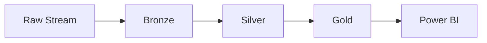

# Delta Lake Pipeline

- Bronze stores raw telemetry with minimal transformation.
- Silver normalizes, validates, and deduplicates the records.
- Gold exposes KPI-ready aggregations for reporting and dashboarding.
