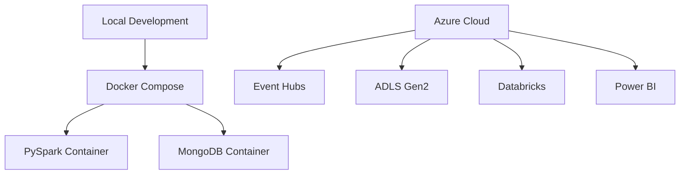

# Deployment Architecture

Local development supports quick validation of the simulator, MongoDB utilities, and PySpark transformation logic. The Azure deployment path matches the same logical flow using managed services.
