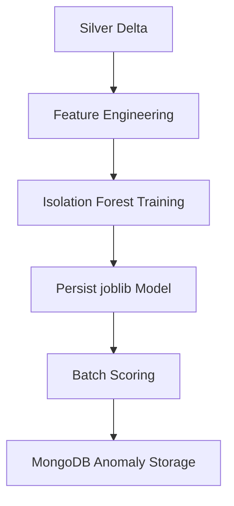

# Machine Learning Pipeline

The anomaly detection workflow is designed as a small, explainable layer built on top of the Silver data. The model flags unusual telemetry patterns that can be investigated operationally.
