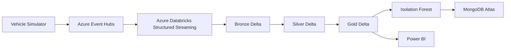

# Overall Architecture

This architecture uses a single streaming ingress and a layered lakehouse model so telemetry can be reused for analytics, reporting, and anomaly detection without building separate pipelines for each consumer.
