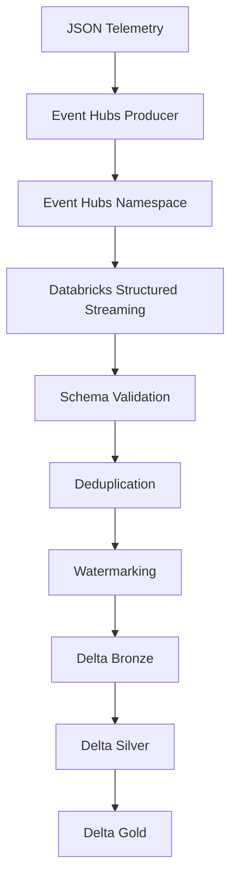

# Streaming Pipeline

The streaming layer is intentionally simple: parse the JSON payload, validate the schema, handle late events with watermarks, and persist the data to Delta Lake in separate stages.
